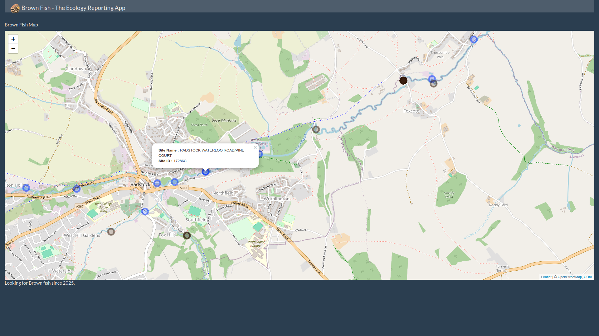
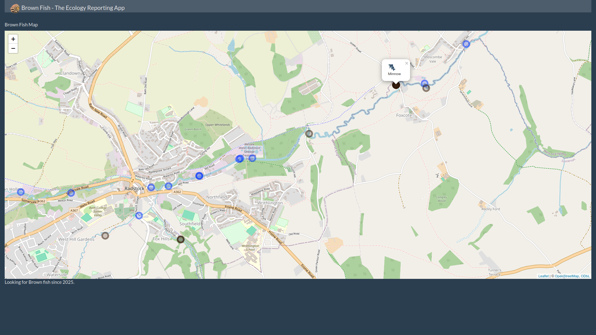
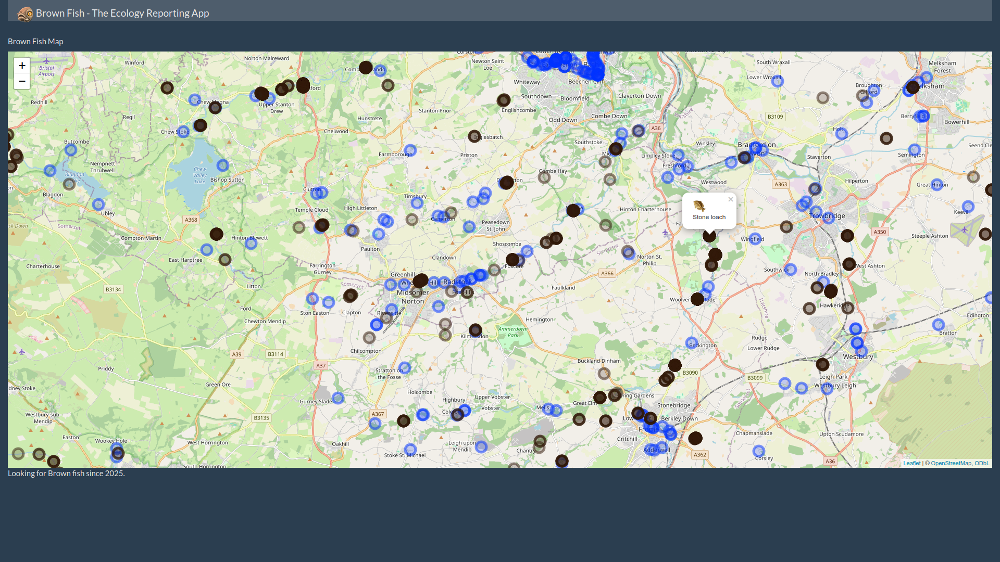

# Open Data Day 2025

<!-- badges: start -->
<!-- badges: end -->

## Challenge Statement

The goal of Open Data Day 2025 is to fulfill the following statement:

"How can we use data to better understand the many challenges and impacts affecting the quality of UK waterways, rivers, lakes and seas in a bid to reduce flooding, pollution, habitat loss, drought and water security?"

## Our Response

We decided to design a prototype app, called "Brown Fish" where users can see existing results from fish surveys, using open data taken from https://environment.data.gov.uk/ecology/explorer/downloads/, and combined that with a provided data set of Event Duration Monitoring data, to provide a map of the lcoations of both.

The idea of the app would be for users to search for what fish are seen near them, what sources of polution there may be near them, and be able to report new instance of either type of data to be added to the app.

This would encourage users to be invested in their local waterways, provide addition survey data, and allow for a balance between the good and bad news of the quality of users local waterways.

## Screenshots

### An interactive map for exploring the data.

### Fish data has corresponding images of fish.

### The map covers all of the Wessex area.

